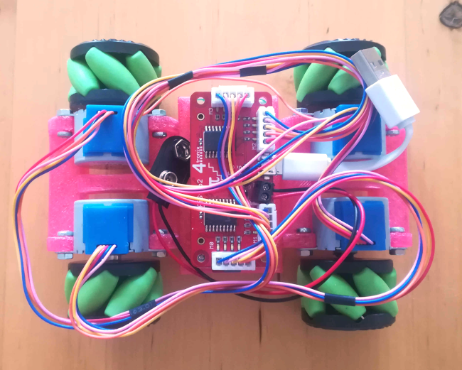
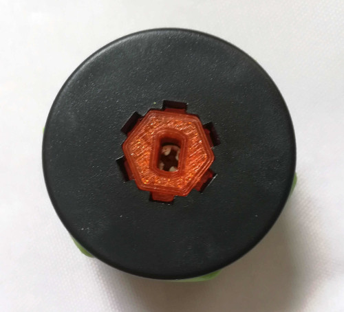
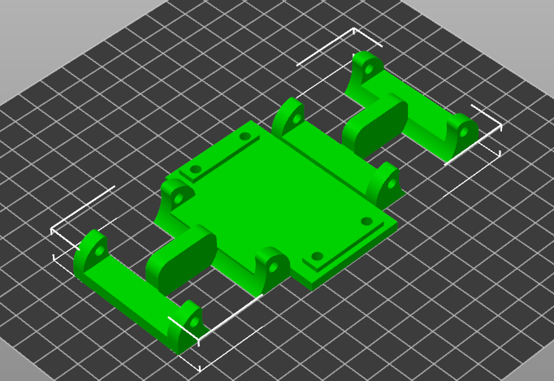

# Raspberry Pi Zero Car with Mecanum Wheels
A prototype for a mecanum wheel car that is controlled by a gamepad. 

### Hardware:
- Raspberry Pi Zero
- 4tronics PiStep2
- Stepper Motors
- Mecanum Wheels

### Software:
The gamepad class uses `evdev` to capture the gamepad input. The variable motorDirection is used by both classes. A lock insures its integrity. The car class controls the stepper motors.

## 3D Printing

I designed an adapter for the stepper motors, because the ones that came with the wheels where for a D profile. 

The chassis is also a custom design.

